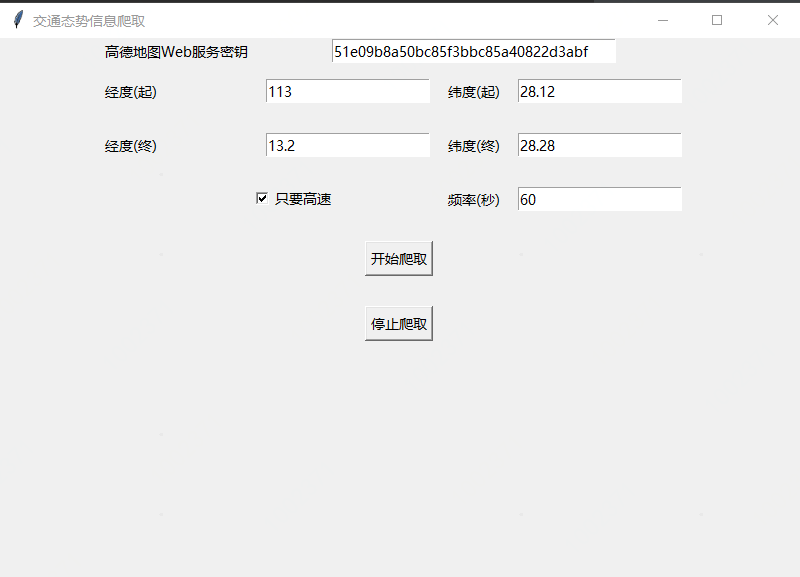

# 长沙交通态势信息爬取
根据经纬度范围，定时抓取交通态势数据，如下图所示
## 快速启动
### 运行环境
1. python3
2. pip3
3. pandas依赖（pip3 install pandas）
### 命令行运行
python3 Application.py
### 表单输入说明
#### 高德地图Web服务密钥
高德地图Web服务密钥为您申请的密钥，如果没有，可使用本程序的默认密钥，但是因为高德地图对单个使用者的密钥每日有调用次数限制，因此，最好使用您本人的密钥。申请教程是https://lbs.amap.com/api/webservice/guide/create-project/get-key
#### 经纬度范围信息
经度（起）、纬度（起）、经度（终）、纬度（终）以及输入项必须为数字，抓取的范围是一个矩形，起点是矩形的左下角，终点是矩形的右上角。如下图所示
#### 频率
定时爬取的频率，但是是秒，建议不要设置太小，这样很容易超过每日调用高德地图Web服务的最大次数

